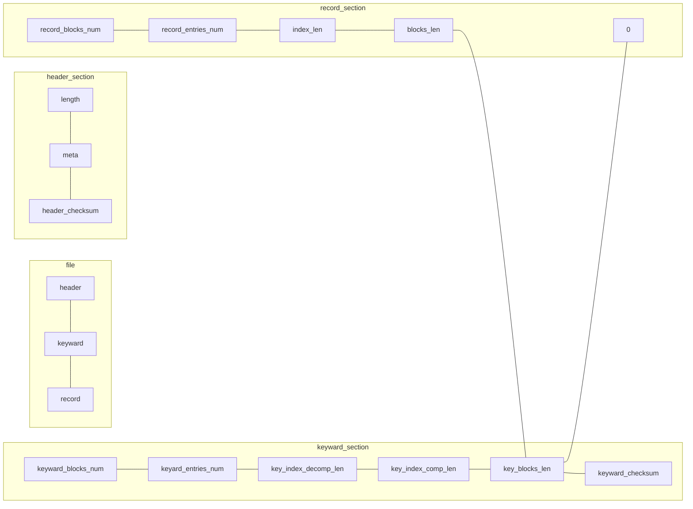

## 文件结构

```mermaid
flowchart LR

    subgraph file
        header --- keyward --- record
    end

    subgraph header_section
        length --- meta --- header_checksum
    end

    subgraph keyward_section
        keyward_blocks_num --- keyard_entries_num --- key_index_decomp_len --- key_index_comp_len --- key_blocks_len --- keyward_checksum
    end

    subgraph record_section
        record_blocks_num --- record_entries_num --- index_len --- blocks_len --- key_blocks_len --- record-block[0]
    end

```